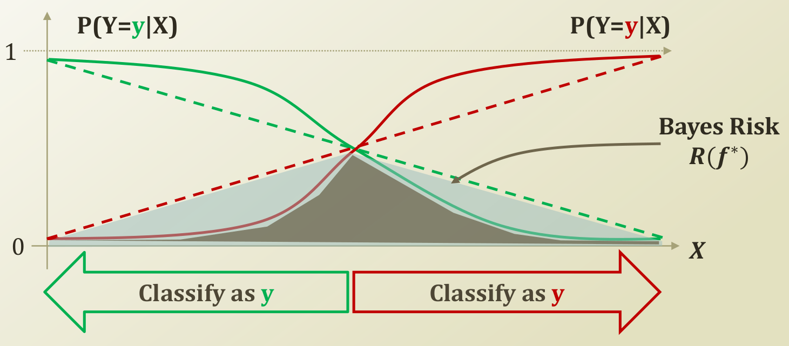

 본 포스트는 [카이스트 문일철 교수님의 강의](https://www.edwith.org/machinelearning1_17/joinLectures/9738) 를 바탕으로 작성하였습니다. 본 게시물에 사용된 두 이미지 또한 [해당 링크](https://www.edwith.org/machinelearning1_17/lecture/10585/) 의 강의 자료를 첨부하였습니다.

# Optimal Classifier

## Bayes classifier

우리의 목적은 예측 $f(X)$ 이 실제 클래스 $Y$와 비교했을 때 어긋날 확률을 최소로 하는 분류기 $f$ 를 찾는 것이다. 이를 최적의 베이즈 분류기라고 하며 간단히 아래와 같이 나타낼 수 있다. (클래스가 2개일 때는 그 아래처럼 쓸 수도 있다.)

$$
f^* = \text{argmin}_f P(f(X) \neq Y) \\
f^* = \text{argmax}_{Y=y} P(Y=y\vert X=x)
$$

최적의 분류기가 실수할 위험도를 나타낸 것을 베이즈 리스크(Bayes Risk, $R(f^*)$ )라고 하자. 베이즈 리스크가 발생하는 이유는 우리가 각 특성 사이에 어떤 관계가 있는지에 관한 정보가 없기 때문이다. 

조건부 확률(Conditional Probability)의 정의를 사용하여 $P(Y=y \vert X=x)$ 를 나타내면 아래와 같다. 이를 위에서 구했던 분류기 $f^*$ 식에 대입하면 $\text{argmax}$ 이하의 식을 Class conditional density 와 Class Prior 로 나타낼 수 있다.

$$
P(Y=y \vert X=x) = \frac{P(Y=y \vert X=x)P(Y=y)}{P(X=x)} \\
f^* = \text{argmax}_{Y=y} P(Y=y\vert X=x) = \text{argmax}_{Y=y} P(X=x\vert Y=y)P(Y=y)
$$

아래의 이미지는 (결정 경계가 같은) 임의의 2쌍의 분류기가 만드는 4가지 곡선(직선)을 나타낸 것이다. 분류기의 종류에 상관없이 한 분류기에 속한 두 곡선이 만나는 점의 $Y$ 값은 0.5이다. 이 때의 $X$ 값을 결정 경계(Decision Boundary)라고 한다. 

 

좋은 분류기는 결정 경계 부근에서 급격하게 변한다. 위 그림에서 실선으로 나타난 분류기는 점선 분류기보다 결정 경계 부근에서 더 급격하게 변하기 때문에 더 좋은 분류기다.

두 분류기 모두 결정 경계를 기준으로 확률이 높은 클래스를 선택하므로 왼쪽 구간에서는 초록색을, 오른쪽 구간에서는 빨간색을 나타낼 것이다. 이 때 비어있는 확률, 즉 왼쪽에서 붉은색이 차지하고 있는 부분과 오른쪽에서 초록색이 차지하고 있는 부분은 에러가 된다. 이 에러를 **Bayes Risk** $R(f^*)$ 라고 한다. Bayes Risk 가 작을수록 좋은 분류기이며 점선 분류기보다는 실선 분류기가 푸르게 칠해진 부분만큼 Bayes Risk 가 작기 때문에 더 좋은 분류기라고 할 수 있다. 

## Optimal Classifier

위에서 베이즈 분류기에 대해 도출한 식은 다음과 같다.

$$
f^* = \text{argmax}_{Y=y} P(Y = y \vert X = x) \\
\qquad \quad\qquad = \text{argmax}_{Y=y} P(X = x \vert Y = y) P(Y = y)
$$

이제 우리는 두 가지에 대해 더 알아야 한다. $P(Y=y)$ 로 나타나는 Class Prior 와 $P(X = x \vert Y = y)$ 로 나타나는 Class Conditional Density 가 그것이다.

# Conditional Independence

[규칙 기반 학습]([https://yngie-c.github.io/machine%20learning/2020/04/05/rule_based/](https://yngie-c.github.io/machine learning/2020/04/05/rule_based/)) 에서 사용했던 예시를 통해 분류기를 만들어보자.

| 하늘 상태 |  온도  | 습도 | 바람 | 해수 온도 | 일기 예보 | 물놀이를 나갈까? |
| :-------: | :----: | :--: | :--: | :-------: | :-------: | :--------------: |
|   맑음    | 따듯함 | 보통 | 강함 |  따듯함   |  일정함   |        예        |
|   맑음    | 따듯함 | 높음 | 강함 |  따듯함   |  일정함   |        예        |
|   흐림    |  추움  | 높음 | 강함 |  따듯함   |  가변적   |      아니오      |
|   맑음    | 따듯함 | 높음 | 강함 |  차가움   |  가변적   |        예        |

표의 첫 번째 데이터가 나타내는 Class Conditional Density 와 Class Prior를 각각 다음과 같이 나타낼 수 있다.

$$
P(X = x \vert Y = y) = P(x_1=맑음, x_2=따듯함, x_3=높음, x_4=강함, x_5=따듯함, x_6=일정함 
\vert y=예) \\
P(Y=y) = P(y=예)
$$

데이터셋 내에 있는 모든 특성이 서로 관계를 맺고 있다고 가정해보자. 클래스가 $k$ 개이고 특성이 $d$ 개일 때 Class Conditional Density를 구하기 위해서는 $(2^d-1)k$ 개의 파라미터가 필요하고 Class Prior를 구하기 위해서는 $k-1$ 개의 파라미터가 필요하다. 6개의 특성과 2개의 클래스를 가진 데이터셋을 위한 분류기를 위해서만도 63개의 파라미터 값을 구해야 한다. 실제의 데이터는 수십~수백 개의 특성과 2개 이상의 클래스를 가진 경우가 많다. 이 때 파라미터의 갯수는 엄청나게 많아지고 우리에게 필요한 데이터셋은 상상이상으로 커지게 된다. 필요한 데이터셋의 크기를 줄이기 위해서 우리는 새로운 가정을 더 추가하게 된다.

## Conditional Independence

특성의 개수인 d를 줄이지 않고도 생성되는 파라미터의 개수를 획기적으로 줄일 수 있는 방법이 있다. **조건부 독립(Conditional Independence)** 이 그 주인공. 조건부 독립이면 어떤 일이 일어나길래 파라미터의 갯수가 줄어드는 것일까? 결론부터 말하면 조건부 독립인 $x_i$ 에 대해서 다음과 같은 식이 성립한다.

$$
P(X= (x_1, ..., x_i)\vert Y=y) \rightarrow \prod_i P(X_i = x_i \vert Y=y)
$$
조건부 독립일 경우 한 사건이 다른 사건에 영향을 주지 않는다. 실제로 비가 오고 번개가 쳤을 때 천둥이 치는 확률과 번개가 쳤을 때 천둥이 치는 확률이 같다. 방금 예시를 조건부 확률을 사용하여 나타내면 다음과 같다.

$$
P(\text{Thunder} \vert \text{Rain, Lightning}) = P(\text{Thunder} \vert \text{Lightning})
$$

이 때 천둥이 치는 것은 비와는 상관이 없으므로 비와 천둥은 조건부 독립이라고 할 수 있다. 조건부 독립의 정의는 아래의 첫번째 식과 같이 나타낼 수 있다. 그리고 이를 통해 아래 식도 이끌어낼 수 있고 이를 확장하면 Class Conditional Density를 위에서 보았던 식처럼 표현할 수 있다. 

$$
( \forall x_1, x_2,y) \qquad P(x_1 \vert x_2, y) = P(x_1 \vert y) \\
P(x_1,x_2 \vert y) = P(x_1 \vert y)P(x_2 \vert y)
$$

## Conditional Independence vs Marginal Independence

특성 간에 조건부 독립이 성립하려면 서로의 관계가 전혀 없다는 가정을 해야 한다. 어떻게 속성 사이에 관계가 없다는 것을 증명할 수 있을까? 아래 그림에 있는 상관과 상관의 명령을 잘 듣는 2명의 직원 A, B 의 예시를 보며 생각해보자. 

 

A가 상관의 명령을 듣지 못하는 상태라고 하자. 이런 상태에서 직원 B가 앞으로 가는 것을 볼 때와 보지 못했을 때 직원 A가 앞으로 갈 확률을 비교해보자. 아마도 전자가 더 클 것이다. 앞으로 가는 직원 B를 봤다면 상관이 명령을 내렸을 것이라고 판단하기 때문이다. 이를 $P$ 를 사용하여 나타내면 다음과 같다.

$$
P(\text{OfficerA=Go} \vert \text{OfficerB=Go}) > P(\text{OfficerA=Go})
$$

따라서 상관의 명령을 확인할 수 없다면 직원 A, B가 앞으로 갈 확률은 **독립(Marginal Independence)** 이 아니다. 만약 둘이 독립이라면 B가 앞으로 가든 말든 A가 갈 확률은 같아야 하기 때문이다. 하지만 상관의 명령을 분명히 확인할 수 있는 상태라면 어떨까? 이 때는 B가 앞으로 가든 말든 상관없이 상사가 가라면 앞으로 가야한다. 이를 $P$ 를 사용하여 아래와 같이 나타낼 수 있다.

$$
P(\text{OfficerA=Go} \vert \text{OfficerB=Go, Commander = Go}) = P(\text{OfficerA=Go} \vert \text{Commander=Go})
$$

이를 조건부 독립이라고 하며 조건부 독립은 상관의 명령, 즉 클래스를 볼 수 있을 때에만 유효하다.

## Naive Bayes Classifier

그렇다면 이 조건부 독립을 적용한 $f^*$ 의 식은 어떻게 될까?

$$
f^* = \text{argmax}_{Y=y} P(X = x \vert Y = y) P(Y = y) \\
\qquad \qquad \sim \text{argmax}_{Y=y} P(Y = y) \prod_{1 \leq i \leq d} P(X_i = x_i \vert Y=y)
$$

조건부 독립을 적용하여 식을 변형시키면 Class Conditional Density 에서 우리가 필요한 파라미터의 개수는 $dk$ 개가 된다. 하지만 특성이 모두 조건부 독립이라는 가정은 너무나도 Naive 하기에 이 분류기를 **나이브 베이즈 분류기(Naive Bayes Classifier)** 라고 한다. 사전 확률이 정확하고 특성이 조건부 독립이라면 나이브 베이즈 분류기는 최적의 분류기(Optimal classifier)가 된다.

하지만 나이브 베이즈 분류기는 몇 가지 문제점을 가지고 있다. 먼저 조건부 독립이라는 가정 자체가 말 그대로 너무 Naive 하다. 실제 데이터에서 특성들은 서로 관계를 가지고 있는 경우가 많기 때문이다. 다음으로 정확한 Class prior 를 추정하기가 어렵다.

[^1]: 이미지 출처 : [해당 링크](https://www.edwith.org/machinelearning1_17/lecture/10585/) 내 학습자료
[^2]: 이미지 출처 : [해당 링크](https://www.edwith.org/machinelearning1_17/lecture/10585/) 내 학습자료